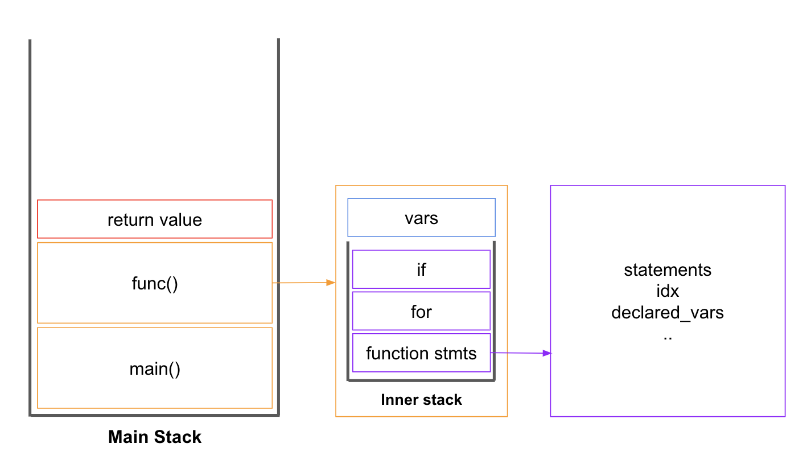

# cs420_project

This project is to implement basic interpreter of C language.


## How to execute

To execute, just run `cinterpreter.py`. All you need to do is to locate your own input source file to inputs/ directory. Run in the root of your project:

```
>> virtualenv -p python3 venv
>> source venv/bin/activate
>> (venv) pip install -r requirements.txt
>> (venv) python cinterpreter.py [INPUT_FILE.c]
```

## Data Structure
The basic data structure we use in this project is below.

